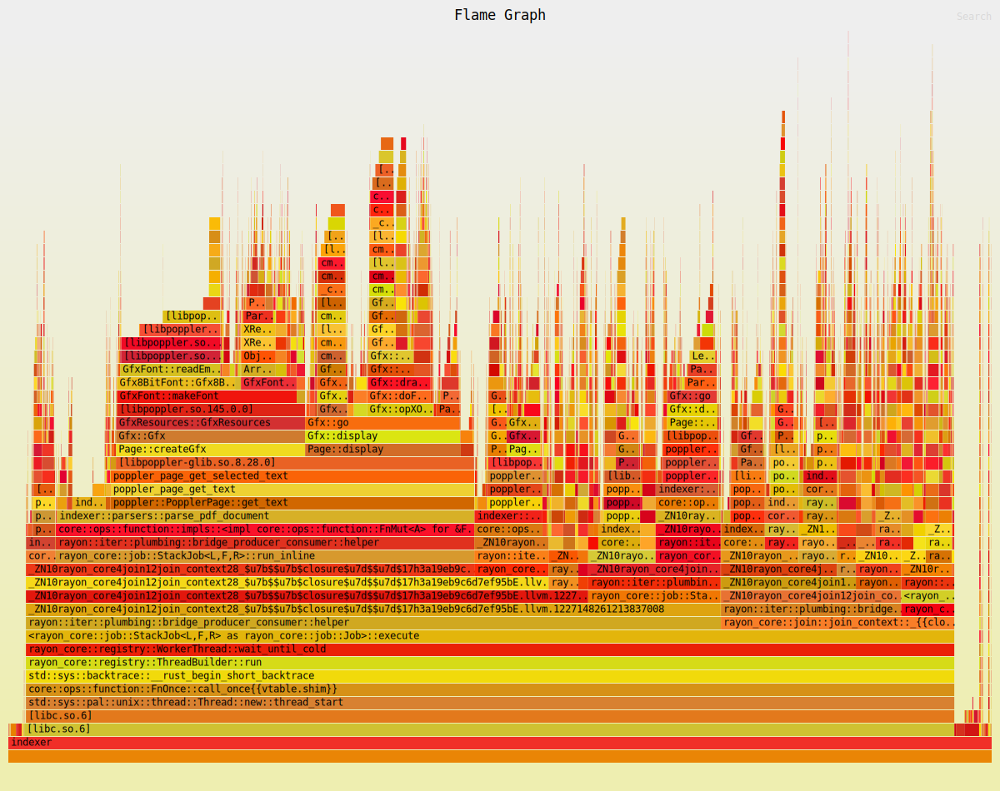

# Local Search Engine



A search engine for local directories implemented in Rust.  
It employs the [tf-idf](https://en.wikipedia.org/wiki/Tf%E2%80%93idf) algorithm for file indexing, [snowball](https://snowballstem.org/) stemming algorithms for token stemming.

## Features

- Indexing pdf files in a directory
- Querying of terms
- Serve via http

## Installation

You may need `libpoppler-glib` installed on you system.  
For arch users

```bash
sudo pacman -S poppler-glib
```

```bash
git clone https://github.com/juanmilkah/indexer
cd indexer
bash build.sh
```

## Usage

- ### Indexing
  If path to docs is not provided it falls back to the current directory.  
  If the path to index file is not specified the fallback is `index_file`.  
  Supported file types:  
  (pdf, txt, md, xml, xhtml, html)

```bash
indexer index [path_to_documents_directory] [path_to_index_file]
```

- ### Querying

```bash
indexer query <path_to_index_file> <query>
```

```console
indexer query docs_index_file "foo bar baz" | less
```

- ### Serving via http server
  Localhost on port `8080`
  The average latency for a query is `45ms`

```bash
indexer serve <path_to_index_file> [port]
```

```bash
curl -X POST http://localhost:8080/query d "foo bar baz"
```

- ### Help page

```bash
indexer --help
```

- ### Version Info

```bash
indexer --version
```

### TODO

The files index is stored in memory while indexing is in progress,
which becomes a bottleneck when the file count gets past 50000.

## Licensing

The project is licensed under the [GPL3 License](LICENSE)
