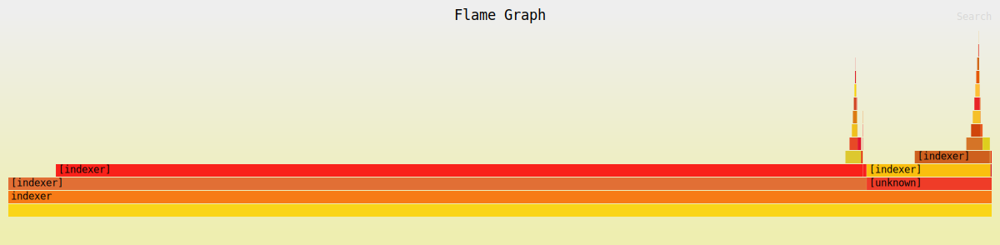

# Local Search Engine



A search engine for local directories implemented in Rust.  
It employs the [tf-idf](https://en.wikipedia.org/wiki/Tf%E2%80%93idf) algorithm for file indexing, [snowball](https://snowballstem.org/) stemming algorithms for token stemming.

## Features

- Indexing files in a directory
- Querying of terms
- Serve via http

## Installation

```bash
git clone https://github.com/juanmilkah/indexer
cd indexer
bash build.sh
```

## Usage

The program uses `$HOME/.indexer` as the default path for the 
index files.  

- ### Indexing
  If path to docs is not provided it falls back to the current directory.  
  Supported file types:  
  (pdf, txt, md, xml, xhtml, html, csv)

```bash
indexer index -p [path_to_document]
```

You can also specify a log file via the `log` argument.

```bash
indexer --log indexer.log index
```

- ### Querying

```bash
indexer query  -q <query> -i [path_to_index_directory] --count [10] 
```

- ### Serving via http server
  Localhost on port `8765`
  The average latency for a query is `45ms`

```bash
indexer serve -i [path_to_index_directory] -p [port]
```

```bash
curl -X POST http://localhost:8080/query d "foo bar baz"
```

- ### Help page

```bash
indexer --help
```

- ### Version Info

```bash
indexer --version
```

## Licensing

The project is licensed under the [GPL3 License](LICENSE)
